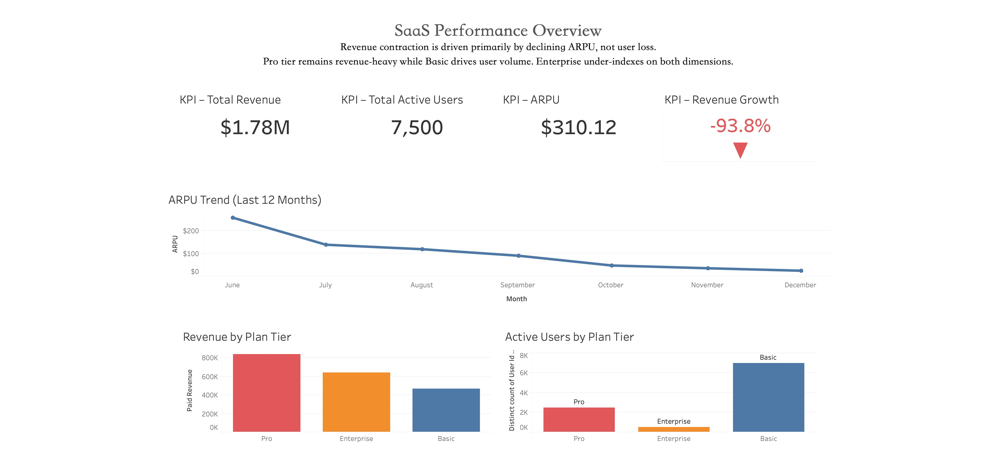
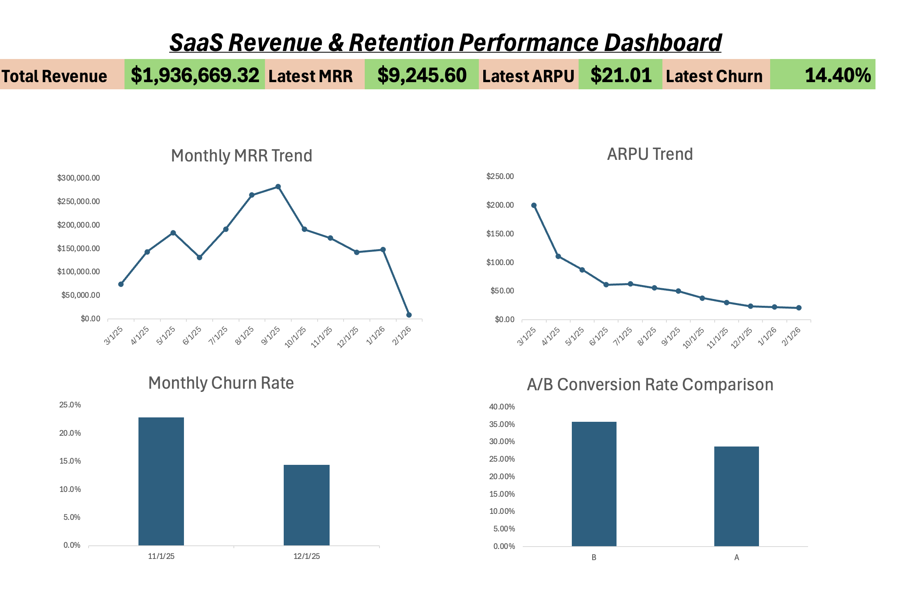

# SaaS Revenue & Retention Analytics

End-to-end SaaS analytics project simulating a subscription-based business model, covering revenue tracking, churn analysis, cohort retention, and A/B pricing experimentation using SQL, Tableau, and Excel.

---

## Problem Statement

SaaS companies must continuously monitor revenue growth, customer retention, and pricing performance to remain competitive.

Key business questions addressed in this project:

- How is Monthly Recurring Revenue (MRR) trending?
- Is ARPU increasing or declining over time?
- What is the monthly churn rate?
- Which pricing tier drives the most revenue?
- Is the pricing experiment statistically significant?
- What is the lifetime value (CLV) of customers?

This project builds a full analytics pipeline to answer these questions using simulated SaaS data.

---

## Project Objectives

- Generate realistic SaaS subscription data
- Design normalized relational database schema
- Build reusable SQL analytical views
- Compute business KPIs (MRR, ARPU, churn)
- Perform cohort retention analysis
- Conduct A/B pricing experiment
- Apply statistical significance testing (Z-test)
- Build executive dashboards in Tableau and Excel

---

## Architecture & Workflow

```
Synthetic Data Generation (SQL)
↓
Relational Schema (Users, Subscriptions, Payments)
↓
Analytical Views (KPIs, Churn, Cohort)
↓
A/B Testing & Statistical Analysis
↓
Tableau Dashboard
↓
Excel Executive KPI Dashboard
```
---
---

## Database Design

### Core Tables

- `users`
- `subscriptions`
- `payments`
- `pricing_experiments`
- `product_events`

### Relationships

- One user → One subscription  
- One subscription → Multiple monthly payments  
- Pricing experiments linked at user level  

---

## Key Metrics Computed

### Revenue Metrics
- Monthly Recurring Revenue (MRR)
- ARPU (Average Revenue Per User)
- Revenue by Plan Tier
- Failed Payment Rate

### Retention Metrics
- Monthly Churn Count
- Churn Rate %
- Cohort Retention Matrix
- Active Subscription Trends

### Experiment Metrics
- Variant A vs B Conversion Rate
- Revenue Impact
- Relative Lift %
- Z-Score Statistical Test

---

## Tableau Dashboard

### Dashboard Overview

- Monthly MRR trend
- ARPU trend over time
- Monthly churn rate
- A/B conversion comparison



---

## Excel Executive Dashboard

Executive KPI dashboard includes:

- Total Revenue
- Latest Month MRR
- Latest ARPU
- Latest Churn Rate
- A/B test calculations
- Z-score significance
- CLV (Customer Lifetime Value)



---

## A/B Testing & Statistical Significance

A pricing experiment was simulated with equal traffic split between Variant A and Variant B.

### Z-Test Formula
```
Z = (p1 - p2) / sqrt(p(1-p)(1/n1 + 1/n2))
```
### Decision Rule

- |Z| > 1.96 → Statistically Significant (95% confidence level)

Results indicate Variant B delivers a statistically significant improvement in conversion rate.

---

## Project Structure
```
saas-revenue-retention-analytics/
│
├── sql/
│   ├── 01_schema_and_seed.sql
│   ├── 02_views.sql
│   ├── 03_revenue_metrics.sql
│   ├── 04_churn_analysis.sql
│   ├── 05_cohort_analysis.sql
│   ├── 06_experiment_data.sql
│   ├── 07_ab_testing.sql
│   └── 08_statistical_significance.sql
│
├── dashboards/
│   └── Saas_Dashboard.twbx
│
├── excel/
│   └── saas_kpi_tracker.xlsx
│
├── assets/
│   └── Saas_Dashboard.JPEG
│
└── README.md

```

---

## Tech Stack

- MySQL
- DBeaver
- Tableau
- Microsoft Excel
- GitHub

---

## Business Insights

- Revenue is concentrated in Pro tier subscriptions.
- ARPU declines as lower-tier user share increases.
- Churn spikes correlate with failed payment events.
- Variant B pricing strategy significantly improves conversion rate.
- Statistical validation confirms experiment impact.

---

## How to Run

1. Run `01_schema_and_seed.sql`
2. Run `02_views.sql`
3. Execute analysis scripts
4. Open Tableau dashboard
5. Open Excel KPI tracker

---

## Outcome

This project demonstrates:

- SQL data modeling
- Revenue and retention analytics
- Cohort analysis
- Experimental design
- Statistical hypothesis testing
- BI dashboard development
- Executive KPI reporting

---

## What This Project Demonstrates

- Business analytics thinking  
- Statistical reasoning  
- Data pipeline design  
- Visualization skills  
- End-to-end ownership  

---


